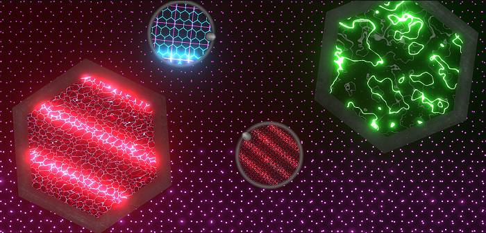

# 2D Neon Grids (Shader Graph) for Unity

**2D Neon Grids** is a **Shader Graph** asset for **Unity**. It allows you to generate 2D grid patterns with two texture layers, customisable color, as well as many different effects like distortion, scan-line, rotation, movement, and tiling.

You you can apply the grid patterns to your Unity games/projects by using **Sprites** or **Quads**. Grids can also be masked off using 2D Sprite Masks.

Use bloom to really make them pop and get those retro neon effects going.

# Table of Contents
1. [Getting Started](#toc1)
2. [Grid Material Configuration](#toc2)
3. [Saving and Loading Grid Configurations at Runtime](#toc3)
4. [Support](#toc4)

## Getting Started 

To get started, import the 2D Neon Grids asset into your project.

If you don't already have the following packages installed, open the Unity Package Manager and install these:

* Universal RP (Universal Render Pipeline)
* Post Processing

Next you'll need to configure your scriptable render pipeline asset (if you don't already have one set).

Open **Edit > Project Settings > Graphics**

Drag and drop the **PipelineAsset** from **Assets/2DNeonGrids/2DRenderer** into the **Scriptable Render Pipeline Settings** slot in the Graphics settings for your project.

At this point you should now be ready to open and run the included Demo scenes.

Open **Assets/2DNeonGrids/Demo/Scenes/DemoSpriteMasks.unity** or **Assets/2DNeonGrids/Demo/Scenes/DemoRandomizer.unity** to check out the included demo scenes.

## Grid Material Configuration 

To configure your grid you'll need:

* A 2D **Sprite** or **Quad** GameObject
* A **Material** set to use the **2DNeonGrids** shader graph shader (there is one included with the asset already)

### Example

* In your scene, create a new Quad GameObject.
* With **Quad** selected, use the Inspector to assign the **Assets/2DNeonGrids/Shaders/2DNeonGridMaterial.material** asset to the **Materials Element 0** slot.

### Adding Neon Bloom / Glow

Create a new **GameObject** in your Scene **Hierarchy** and name it **Volume**. Use the Inspector to add a **Volume** component. In the **Volume** component Inspector options, click **New** next to the **Profile** field. A new profile called **Volume Profile (VolumeProfile)** is created.

Click the **Add Override** button and type **Bloom** to add a Bloom volume effect.

Configure the **Bloom** settings to have:

* **Threshold: 2**
* **Intensity: 0.7** 

### Configure grid shader settings

Rollout the **2DNeonGridMaterial Shader** section in the Inspector (near the bottom), and you can begin customizing your grid with the properties exposed here.

The following are descriptions of what each exposed setting does:

* **MainGridTexture** - the primary, or main grid texture which is set to **Wrap Mode** '**Repeat**'
* **SecondaryGridTexture** - the primary, or main grid texture which is set to **Wrap Mode** '**Repeat**'
* **ScanlineTexture** - the texture which is used for the optional scanline scrolling effect on the grid.
* **Tiling** - a Vector4 property which is used to control the **X** and **Y** tiling of the grid textures.
* **MainGridColor** - the color used for the Main Grid texture. Use an **HDR** color with Intensity to increase bloom/glow effect.
* **SecondaryGridColor** - the color used for the Main Grid texture. Use an **HDR** color with Intensity to increase bloom/glow effect.
* **MainGridDistortionNoiseScale** - used to increase the noise texture scaling effect (Simple or Gradient Noise) on the main grid.
* **SecondaryGridDistortionNoiseScale** - used to increase the noise texture scaling effect (Simple or Gradient Noise) on the secondary grid.
* **ScanlineEffectOpacity** - used to increase or decrease the scanline 'area of effect'.
* **ScanlineSpeed** - increase or decrease downward/upward scanline movement.
* **VerticalScanTilingFactor** - used to increase or decrease the number of scanlines. You could for example use this to create CRT monitor-like effects.
* **OverallAlpha** - an overall alpha or opacity setting to make the final grid texture see-through or opaque.
* **MainGridRotationSpeed** - used to rotate the main grid texture.
* **SecondaryGridRotationSpeed** - used to rotate the secondary grid texture.
* **SecondaryGridXMoveFactor** - used to apply a sine-like movement to the secondary grid texture on the X-axis.
* **SecondaryGridYMoveFactor** - used to apply a sine-like movement to the secondary grid texture on the Y-axis.
* **InvertMainGridColor** - inverts the main grid texture color.
* **InvertSecondaryGridColor** - inverts the secondary grid texture color.
* **MainGridUseGradientNoise** - toggle this on to use Gradient (Perlin) Noise instead of Simple Noise on the main grid texture.
* **SecondaryGridUseGradientNoise** - toggle this on to use Gradient (Perlin) Noise instead of Simple Noise on the secondary grid texture.

Configure the grid settings as follows for a sample grid:

Run the scene. Your Quad grid texture should look like the following, and be animating using the grid's various effects. 

You can play around with different effects by trying out different textures for the Main and Secondary Grid, as well as Scanline texture settings. These, in combination with the exposed properties listed above can result in thousands of different grid configurations. Use the **DemoRandomizer** example scene and click the **Random** button multiple times, with different color schemes selected to get some inspiration.

## Saving and Loading Grid Configurations at Runtime 

Grids configurations from the **DemoRandomizer.unity** scene can be saved to JSON format on disk and dynamically re-loaded at runtime. To save a Grid that you like (or have customised in the Editor at runtime, do the following:

* Click **Save Grid**
* Open your project's **Assets** folder and you'll see a randomly (GUID) named JSON file. This file contains the grid's configuration serialized to file.

To load grids from previously saved JSON format at runtime, move the JSON file into **Assets/2DNeonGrids/Demo/SavedDemoGrids** and run the demo scene again. Click the Demo button and all Grid Configuration JSON files in that folder will be loaded. The scene will then cycle through each one every 3 seconds.

If you would like to learn how to dynamically configure your 2D Neon Grids shader materials at runtime / from code, then take a look at the **DemoGrids.cs** script, and specifically the `LoadGridConfig` method.

**Note:** The asset includes a bunch of demo saved grid configurations in the **2DNeonGrids/Demo/SavedDemoGrids** asset folder. By default the **DemoRandomizer** scene will load the grids from this path in your project, however you can pinpoint a different location to load the JSON grid configuration files by entering a path value in the **Saved Grid Json Configs Dir** field.

## Support 

If you need help or support, please get in touch using the contact form here: [Contact](https://hobbyistcoder.com/contact/) or e-mail: apps@shogan.co.uk